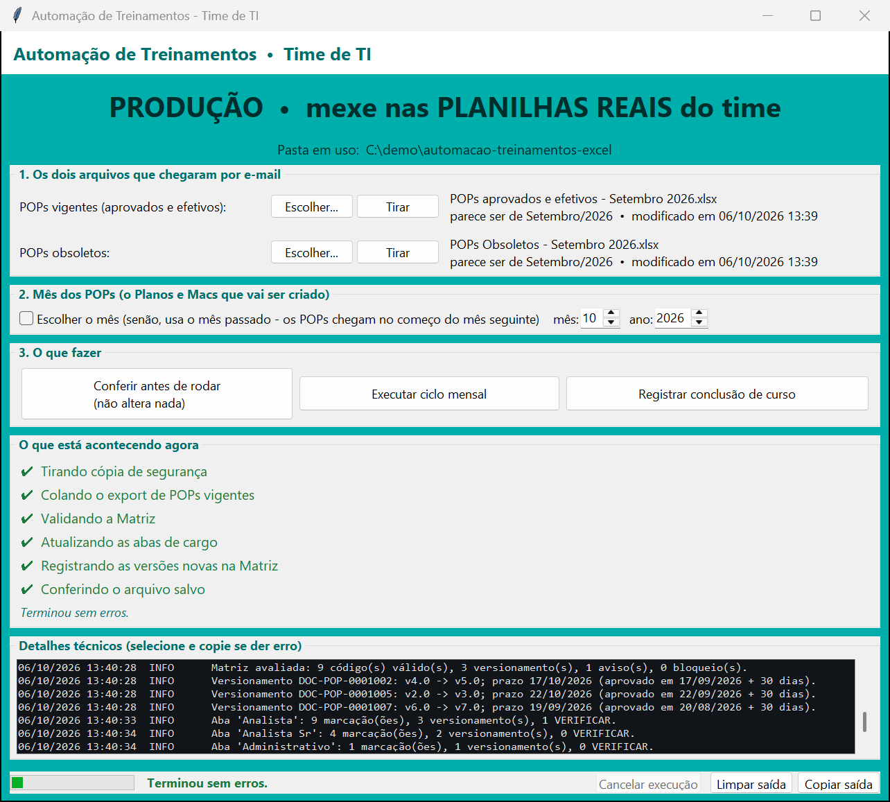
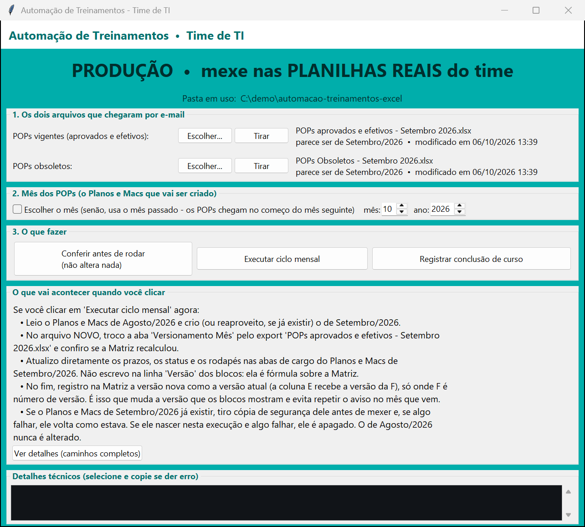
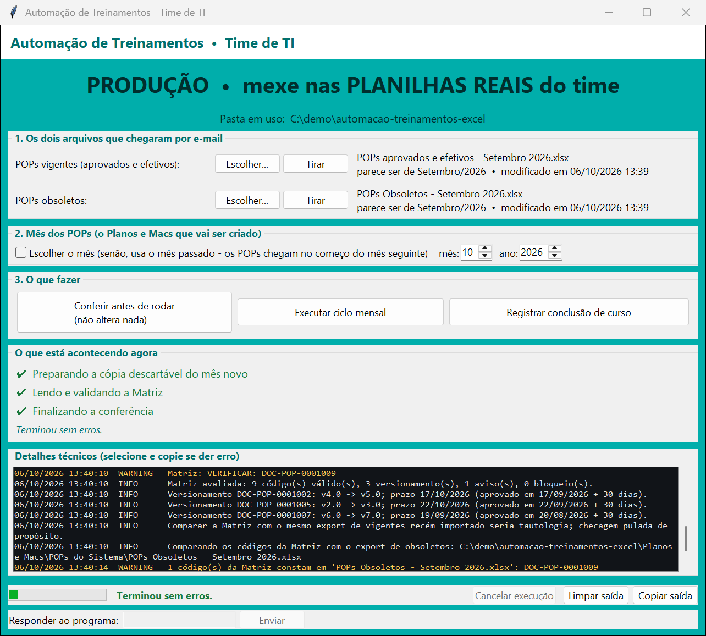
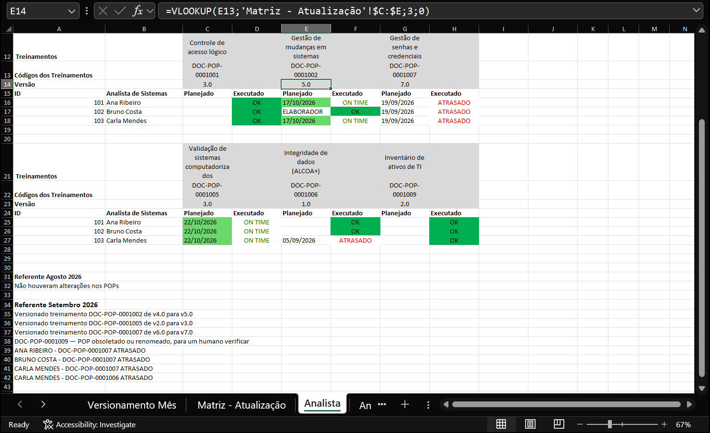
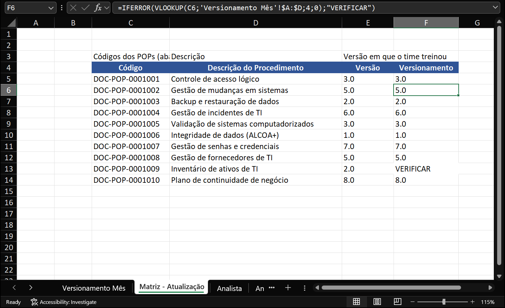

# Automação de Treinamentos em Excel

Automação em **Python + xlwings** do ciclo mensal de controle de treinamentos de um time de TI:
a partir dos exports do sistema de documentos, o programa gera a planilha do mês, marca prazos e
status de cada pessoa, escreve o registro de auditoria e confere o próprio resultado — com um
painel simples para quem opera a planilha no dia a dia.

> Versão pública e sanitizada de uma ferramenta interna em uso. Nomes de pessoas, da empresa,
> códigos de documentos e nomes de abas foram trocados; os dados da demonstração são fictícios.



---

## O problema

Em ambiente regulado (indústria farmacêutica), cada pessoa precisa estar treinada na **versão
vigente** de cada procedimento (POP) do seu cargo. Isso é controlado numa planilha mensal,
*Planos e Macs &lt;Mês&gt; &lt;Ano&gt;.xlsx*, com:

- uma **Matriz** com todos os POPs do time, a versão em que o time treinou e a versão vigente
  (calculada por PROCV sobre o export do sistema);
- uma **aba por cargo**, com blocos de POPs e, para cada pessoa, o prazo planejado e o status
  (OK, ON TIME, ATRASADO, ELABORADOR, HSE, NA…);
- um **rodapé de auditoria** por mês ("Referente Setembro 2026 — versionado o POP X de v4.0 para v5.0…").

Todo mês, ao receber os exports de POPs vigentes e obsoletos, alguém precisava copiar a planilha
do mês anterior, colar o export, descobrir quais POPs mudaram de versão, abrir cada aba de cargo,
calcular o prazo de cada pessoa (aprovação + 30 dias), marcar ON TIME ou ATRASADO sem pisar nas
exceções, escrever o rodapé e atualizar a Matriz. Trabalho manual, repetitivo e fácil de errar.

## O que o programa faz

| Ação | O que acontece |
| --- | --- |
| **Conferir antes de rodar** | Simula o ciclo inteiro numa cópia descartável e mostra versionamentos, avisos e bloqueios. Não altera nada. |
| **Executar ciclo mensal** | Cria o Planos e Macs do mês a partir do anterior (que **nunca** é alterado), importa o export, confere que a Matriz recalculou, marca prazos e status nas abas de cargo, escreve o rodapé, registra as versões novas na Matriz e, no fim, **reabre o arquivo salvo e confere** o que foi gravado. |
| **Registrar conclusão de curso** | Troca o ON TIME/ATRASADO de uma pessoa por OK, só onde ainda está pendente. |

Tudo isso por um **painel em tkinter** (pensado para quem não é técnico) ou pela linha de comando.

## Telas

**Painel antes de rodar** — mostra, em português simples, o que cada botão vai fazer e em quais arquivos:



**Conferir antes de rodar** — 3 POPs versionaram (com prazo), 1 POP sumiu do export e foi achado na lista de obsoletos:



**Resultado numa aba de cargo** — prazos (aprovação + 30 dias), ON TIME/ATRASADO, exceções preservadas
(ELABORADOR, OK de quem já treinou) e o rodapé "Referente Setembro 2026" escrito pelo programa:



**Matriz depois do ciclo** — a coluna *Versão* recebeu a versão nova; o POP obsoletado fica como VERIFICAR para um humano decidir:



## Como funciona

### Segurança antes de escrever

- **Transação de arquivo:** antes de mexer, o programa tira uma cópia do arquivo; se qualquer etapa
  falha, o arquivo volta a ser exatamente o que era (e, se ele nasceu nesta execução, é apagado).
  Se nem a restauração der certo, o programa diz isso com todas as letras (código de saída próprio).
- **Bloqueios:** o ciclo não roda se a Matriz estiver num estado em que o resultado seria errado —
  versão fora do padrão `N.0`, coluna de versão com fórmula no lugar do valor, versão que
  regrediu, POP sem data de aprovação, aba de cargo faltando, ou rodapé do mês já escrito
  (reprocessamento exige confirmação explícita).
- **Arquivo aberto:** se a planilha estiver aberta no Excel de alguém, o programa avisa e não altera nada.
- **O que o conferir mostra é o que o ciclo faz:** os dois usam a mesma avaliação pura da Matriz (`dominio.avaliar_matriz`).
- **Conferência pós-gravação:** depois de salvar, o arquivo é reaberto e as versões novas e uma amostra das marcações são relidas.

### Problemas do mundo real que precisaram de solução

- **O Excel converte o texto `"1.0"` no número `1`** ao escrever via COM — e a Matriz inteira
  "versionava" do nada. Solução: gravar versões com prefixo de texto (apóstrofo).
- **AutoSave do OneDrive grava alterações mesmo fechando sem salvar** — por isso a transação é
  física (cópia e restauração do arquivo), e não "fechar sem salvar".
- **`SaveAs` falha dentro de pastas sincronizadas pelo OneDrive** — o arquivo do mês é criado por
  cópia e salvo no lugar.
- **Um Excel invisível que não fecha trava a máquina da operadora** — o encerramento tem
  retentativas COM limitadas e, se preciso, mata o processo pelo PID guardado na abertura.
- **Rodar a partir de um servidor de arquivos (caminho UNC):** o `cmd` não entra em pastas UNC, então
  os `.bat` usam só caminhos absolutos; o ambiente virtual fica no perfil de cada usuário (o Python
  da Microsoft Store desvia em silêncio escritas em `AppData`).

### Arquitetura

```
_Automação/treinamentos_its/
├── dominio.py, versionamento.py, excel_utils.py   regras de negócio PURAS (sem Excel) — o grosso dos testes
├── excel_app.py                                    abertura/encerramento padronizado do Excel (xlwings)
├── vigentes.py                                     importa o export e confere o recálculo da Matriz
├── planos_macs.py                                  cria o arquivo do mês e grava abas de cargo, rodapé e Matriz
├── conclusao.py                                    registro de conclusão de curso
├── backup.py                                       transação de arquivo (cópia/restauração) e checagem de arquivo aberto
├── sync.py, conferir.py, reprocessamento.py        orquestração do ciclo e da conferência
├── cli.py                                          linha de comando (sync, conferir, concluir…)
├── gui.py, plano_execucao.py                       painel tkinter: casca fina que roda o main.py num subprocesso
└── config.py, logger.py, relatorio.py, …
```

O painel não executa o ciclo dentro dele: monta o comando, roda `main.py` num subprocesso, mostra a
saída e traduz o desfecho (ok, nada alterado, alerta, erro). Assim, painel e linha de comando nunca divergem.

## Testes

```
729 passed
```

~7 mil linhas de testes `pytest` que rodam **sem Excel**: o xlwings é substituído por dublês
(`tests/dubles_excel.py`). Além das regras de negócio, há testes de "erro de operador" (export do mês
errado, arquivo faltando, ano 9999, planilha aberta…). A integração com o Excel real foi validada em
cópias das planilhas e, depois, em produção, acompanhando a operadora ciclo a ciclo.

## Rodando a demonstração

Requisitos: **Windows**, **Microsoft Excel** (desktop) e **Python 3** (testado no 3.13).

```powershell
# na raiz do repositório
py -m venv _Automação\venv
_Automação\venv\Scripts\python -m pip install -r _Automação\requirements-dev.txt

# gera "Planos e Macs/" com o mês anterior (Agosto/2026) e os exports de Setembro/2026, tudo fictício
_Automação\venv\Scripts\python demo\gerar_planilhas_demo.py

# testes
cd _Automação
venv\Scripts\python -m pytest
```

**Pelo painel** (o mesmo que a operadora usa):

```powershell
cd _Automação
venv\Scripts\python -m treinamentos_its.gui --somente-producao
```

Escolha os dois exports em `Planos e Macs\POPs do Sistema`, marque **Escolher o mês** com mês 9 e
ano 2026 (o padrão é "o mês passado" em relação a hoje) e clique em *Conferir antes de rodar* e depois
em *Executar ciclo mensal*.

**Pela linha de comando:**

```powershell
cd _Automação
$pops = "..\Planos e Macs\POPs do Sistema"
venv\Scripts\python main.py conferir --mes 9 --ano 2026 --pops-vigentes "$pops\POPs aprovados e efetivos - Setembro 2026.xlsx" --pops-obsoletos "$pops\POPs Obsoletos - Setembro 2026.xlsx"
venv\Scripts\python main.py sync --mes 9 --ano 2026 --vigentes "$pops\POPs aprovados e efetivos - Setembro 2026.xlsx"
venv\Scripts\python main.py concluir "Ana Ribeiro" DOC-POP-0001002 --data 10/10/2026 --mes 9 --ano 2026
```

Regra do mês: os POPs de **Setembro** chegam no começo de Outubro; com eles e o Planos e Macs de
**Agosto**, o programa cria o de **Setembro** (rodapé "Referente Setembro 2026").

## Estrutura do repositório

```
.
├── _Automação/                         o programa (fica ao lado da pasta "Planos e Macs/")
│   ├── treinamentos_its/               pacote Python
│   ├── tests/                          suíte pytest
│   ├── tools/                          .bat de apoio do time (linha de comando, ambiente de teste)
│   ├── Abrir Painel de Treinamentos.bat   atalho da operadora (cria o ambiente e abre o painel)
│   ├── main.py
│   └── requirements.txt / requirements-dev.txt
├── demo/gerar_planilhas_demo.py        gera as planilhas fictícias
└── docs/img/                           prints desta página (tirados do programa rodando na demo)
```
